# Ticket Resale Application

  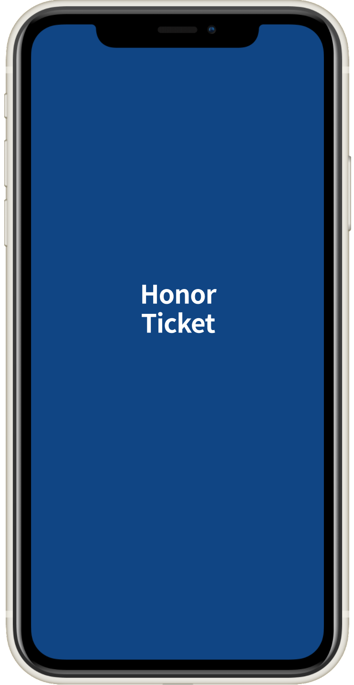 
  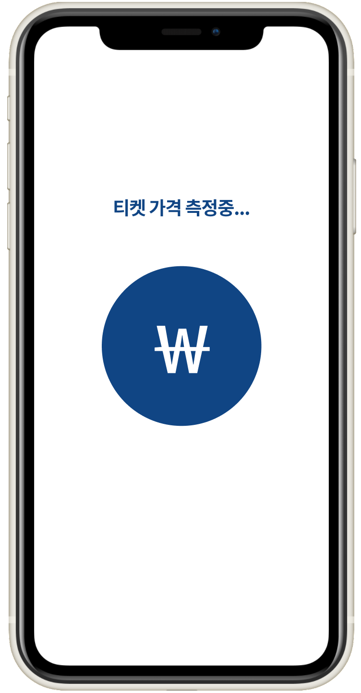 
  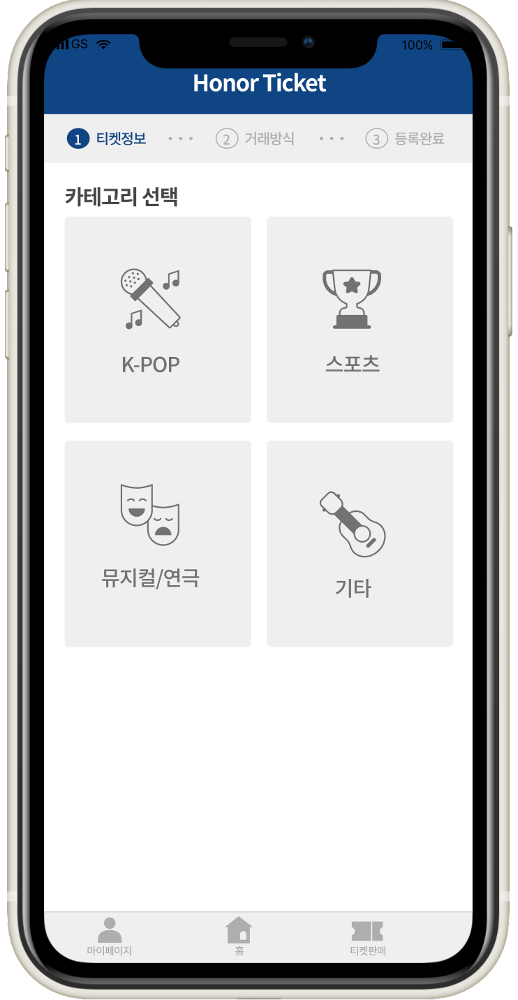

## Introduction

> "Ticket Resale" is the app for hading over tickets at a original price

- 최근, 유명 가수의 콘서트, 스포츠 경기 등에서 티켓 사재기가 성행하고, 정가보다 상당히 높은 가격으로 티켓이 거래되면서 사회적 문제로 부각되고 있습니다. 
하지만 이러한 티켓 불법 양도속에서 sns나 팬카페에서 정가로 티켓을 판매,구매하는 사람들이 있었습니다. 
    
- <strong>정가양도를 원하는 사람들에게 안전하고, 편리하게 거래할 수 있는 플랫폼을 제공하고, 사회의 문제 해결에 기여할 수 있는 티켓 양도 플랫폼을 개발하고자 했습니다. </strong>

#### 1. homepage

  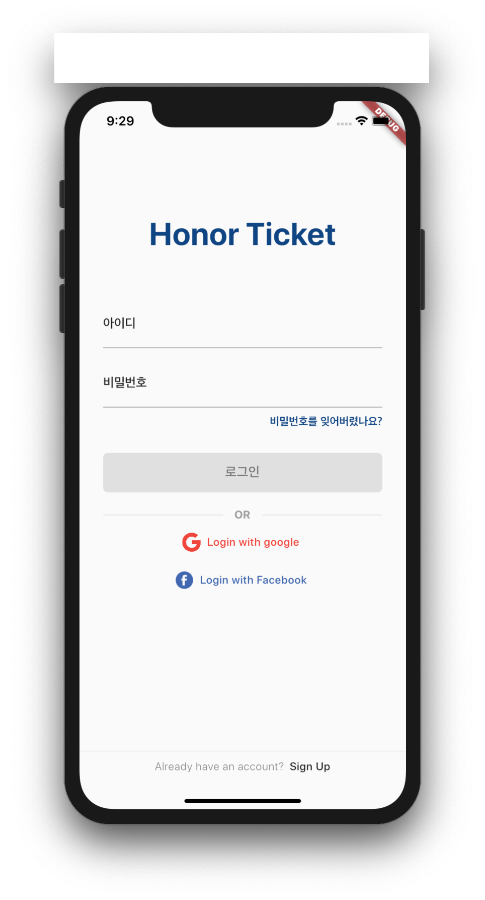 
  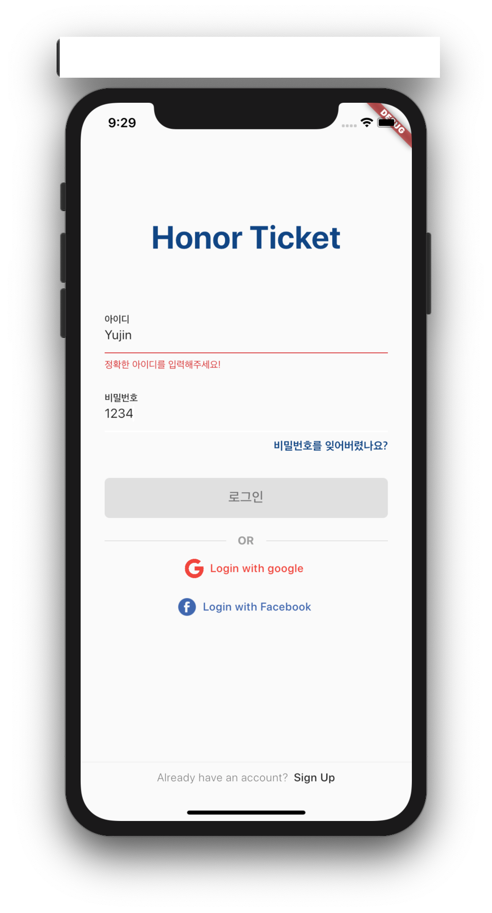 
  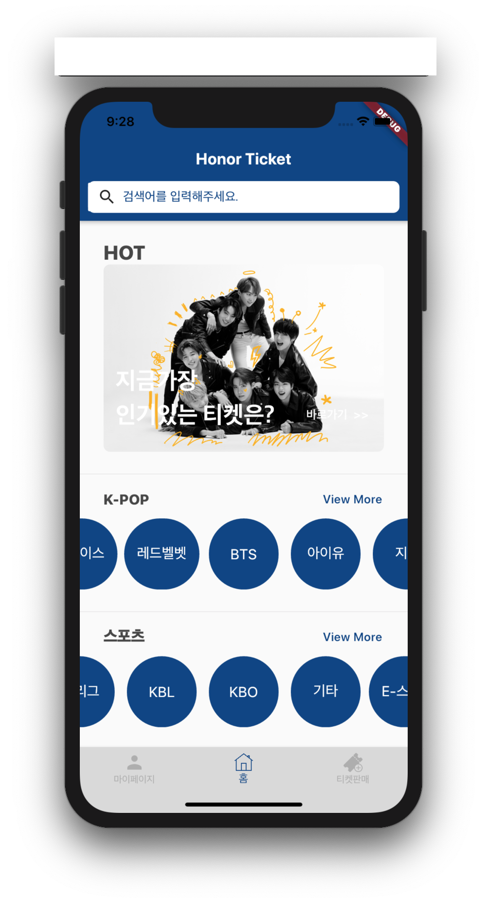

#### 2. ticket list & reservation

  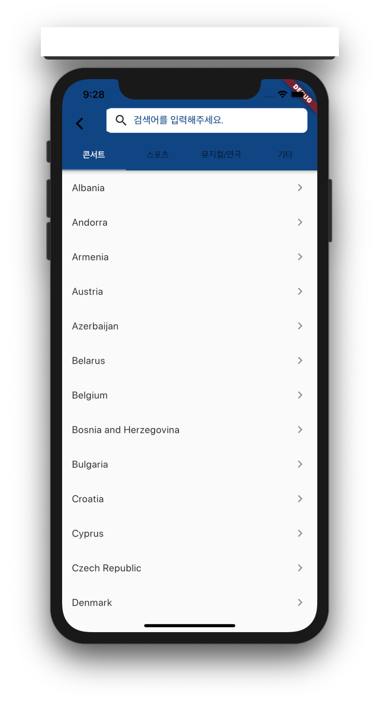 
  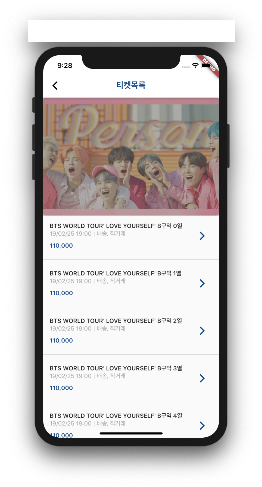 
  
  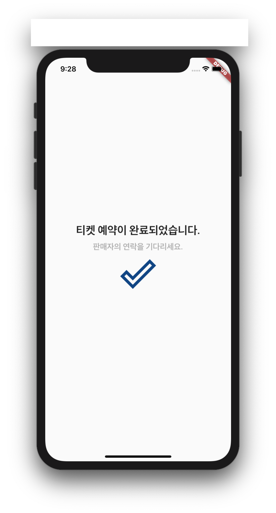

#### 3. ticket registration

  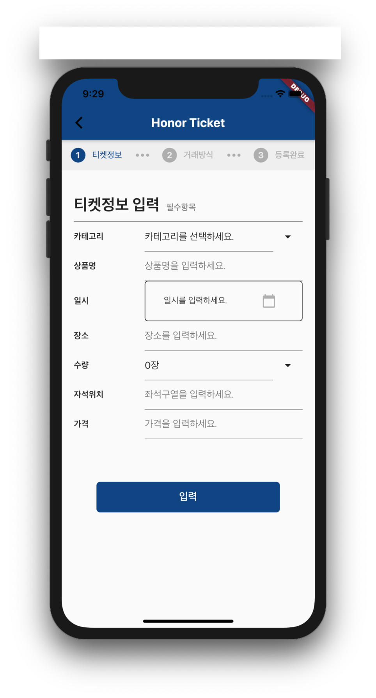 

#### 4. mypage

  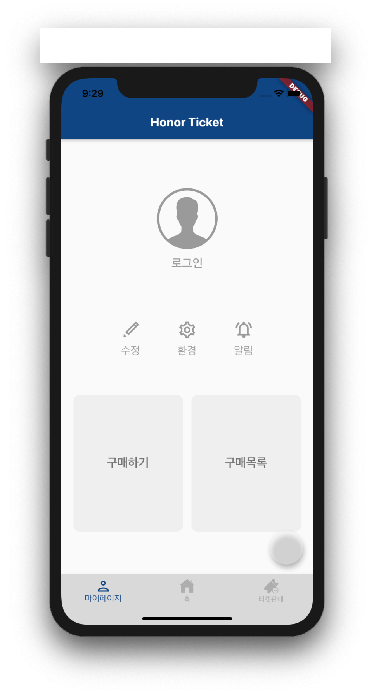 
  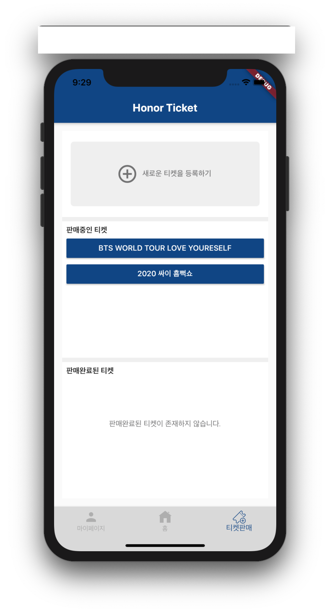 

## Development Environment & Language
- Android studio 3.5.3
- Version 11.5 
- Flutter 1.17.4
- <strong>dart</strong>

 

